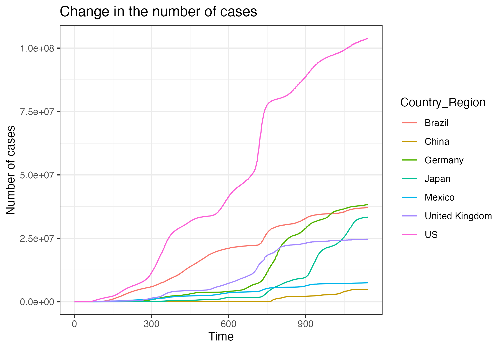
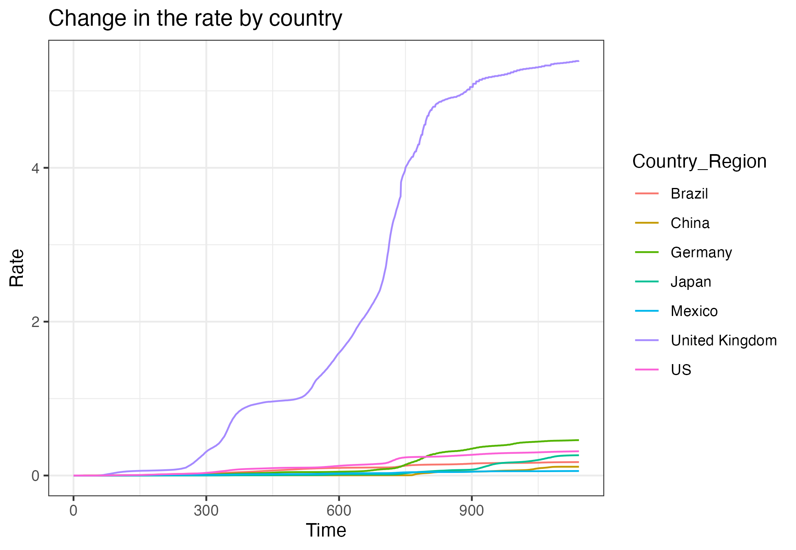

# COVID-19 Analysis

## -Using data from the Center for Systems Science and Engineering (CSSE) at Johns Hopkins University-

## Description

The goal of this project is to analyze the trends of COVID-19 cases between January 22, 2022, and March 9, 2023. The analysis focuses on understanding the overall changes in COVID-19 cases and variations across seven different countries (Germany, China, Japan, United Kingdom, US, Brazil, Mexico, during this period. The dataset in this analysis was obtained from the Center for [Systems Science and Engineering (CSSE) at Johns Hopkins University](https://github.com/CSSEGISandData/COVID-19/tree/4360e50239b4eb6b22f3a1759323748f36752177/csse_covid_19_data). The data was downloaded on 10 April 2024.

Original datasets are UID_ISO_FIPS_LookUp_Table.csv and time_series_covid19_confirmed_global.csv, and the merged dataset was used for this analysis. The final dataset contains variables below:

-   **FIPS**: US only. Federal Information Processing Standards code that uniquely identifies counties within the USA.
-   **UID**: Unique Identifier for each row entry.
-   **ISO3**: Officially assigned country code identifiers.
-   **FIPS**: Federal Information Processing Standards code that uniquely identifies counties within the USA.
-   **Admin2**: County name. US only.
-   **Province_State**: Province, state or dependency name.
-   **Country_Region**: Country, region or sovereignty name. The names of locations included on the Website correspond with the official designations used by the U.S. Department of State.
-   **Lat** and **Long**: Dot locations on the dashboard. All points (except for Australia) shown on the map are based on geographic centroids, and are not representative of a specific address, building or any location at a spatial scale finer than a province/state. Australian dots are located at the centroid of the largest city in each state.
-   **Population**: Population data in the country.
-   **time**: Date of data collection for each case record.
-   **case**: The count of COVID-19 cases recorded.


## Organization of the repo

This repository is organized as follows:

-   **/data** - Contains the merged datasets used in the analysis.
-   **/script** - Contains a markdown document used to generate an analytic notebook.
-   **/report** - Contains an analytic notebook (PDF Rmarkdown) that shows all the syntax and the results for the analysis.
-   **/figs** - Contains figures (plot, etc) generated during the analysis.
-   **/documentation** - Contains instructional documents and a README HTML version.


## Analysis steps

1.  Data cleaning process was conducted in R using RStudio server on Amazon Web Services (AWS).
2.  Two original datasets were merged, retaining only a subset of data comprising Germany, China, Japan, United Kingdom, US, Brazil, and Mexico for further analysis using Spark.
3.  Data analysis was performed in Spark, which involved the following steps:
    -   **Descriptive analysis**: Graphs illustrating the change in the number of cases and the change in rate by country were generated.
    -   **Modeling**: A linear regression model was applied to fit the log of the number of cases, with predictors including country, population size, and day since the start of the pandemic.
    

## Overview of findings from the analysis

The two graphs presented below illustrate how the number of cases and rate change over time by seven selected countries. All seven countries exhibit increasing trends in the number of COVID cases over time. Notably, US has experienced particularly rapid increases in the number of cases, while other countries show a more steady trend. Also, The rate of cases is significantly and rapidly increasing over time in the United Kingdom, whereas other countries exhibit a more steady trend. The linear regression model shows that all predictors (country, population, and days) significantly influence the log number of COVID19 cases.


*Figure 1*


*Figure 2*


## Session info:
```
R version 4.3.1 (2023-06-16)
Platform: x86_64-pc-linux-gnu (64-bit)
Running under: Ubuntu 22.04.2 LTS
<<<<<<< HEAD
=======

Matrix products: default
BLAS:   /usr/lib/x86_64-linux-gnu/openblas-pthread/libblas.so.3 
LAPACK: /usr/lib/x86_64-linux-gnu/openblas-pthread/libopenblasp-r0.3.20.so;  LAPACK version 3.10.0

locale:
 [1] LC_CTYPE=C.UTF-8       LC_NUMERIC=C           LC_TIME=C.UTF-8        LC_COLLATE=C.UTF-8    
 [5] LC_MONETARY=C.UTF-8    LC_MESSAGES=C.UTF-8    LC_PAPER=C.UTF-8       LC_NAME=C             
 [9] LC_ADDRESS=C           LC_TELEPHONE=C         LC_MEASUREMENT=C.UTF-8 LC_IDENTIFICATION=C   

time zone: Etc/UTC
tzcode source: system (glibc)

attached base packages:
[1] stats     graphics  grDevices utils     datasets  methods   base     

other attached packages:
 [1] sparklyr_1.8.5  haven_2.5.3     knitr_1.46      texreg_1.39.3   broom_1.0.5     forcats_1.0.0  
 [7] stringr_1.5.0   dplyr_1.1.2     purrr_1.0.2     readr_2.1.4     tibble_3.2.1    ggplot2_3.4.3  
[13] tidyverse_2.0.0 lubridate_1.9.2 tidyr_1.3.0    

loaded via a namespace (and not attached):
 [1] jsonlite_1.8.7    gtable_0.3.4      compiler_4.3.1    tidyselect_1.2.1  parallel_4.3.1   
 [6] scales_1.2.1      yaml_2.3.7        R6_2.5.1          generics_0.1.3    backports_1.4.1  
[11] openssl_2.1.0     munsell_0.5.0     DBI_1.1.3         pillar_1.9.0      tzdb_0.4.0       
[16] rlang_1.1.1       utf8_1.2.3        stringi_1.7.12    xfun_0.43         config_0.3.2     
[21] timechange_0.2.0  cli_3.6.1         withr_2.5.0       magrittr_2.0.3    grid_4.3.1       
[26] rstudioapi_0.15.0 dbplyr_2.5.0      askpass_1.1       hms_1.1.3         lifecycle_1.0.3  
[31] vctrs_0.6.3       glue_1.6.2        fansi_1.0.4       colorspace_2.1-0  httr_1.4.7       
[36] tools_4.3.1       pkgconfig_2.0.3
```
>>>>>>> 66e544de888d1530506c54d3c5321c1bbd9899d7

Matrix products: default
BLAS:   /usr/lib/x86_64-linux-gnu/openblas-pthread/libblas.so.3 
LAPACK: /usr/lib/x86_64-linux-gnu/openblas-pthread/libopenblasp-r0.3.20.so;  LAPACK version 3.10.0

locale:
 [1] LC_CTYPE=C.UTF-8       LC_NUMERIC=C           LC_TIME=C.UTF-8        LC_COLLATE=C.UTF-8    
 [5] LC_MONETARY=C.UTF-8    LC_MESSAGES=C.UTF-8    LC_PAPER=C.UTF-8       LC_NAME=C             
 [9] LC_ADDRESS=C           LC_TELEPHONE=C         LC_MEASUREMENT=C.UTF-8 LC_IDENTIFICATION=C   

time zone: Etc/UTC
tzcode source: system (glibc)

attached base packages:
[1] stats     graphics  grDevices utils     datasets  methods   base     

other attached packages:
 [1] knitr_1.46      texreg_1.39.3   broom_1.0.5     forcats_1.0.0   stringr_1.5.0   purrr_1.0.2    
 [7] readr_2.1.4     tibble_3.2.1    tidyverse_2.0.0 lubridate_1.9.2 tidyr_1.3.0     sparklyr_1.8.5 
[13] haven_2.5.3     dplyr_1.1.2     ggplot2_3.4.3  

loaded via a namespace (and not attached):
 [1] gtable_0.3.4      jsonlite_1.8.7    compiler_4.3.1    tidyselect_1.2.1  parallel_4.3.1   
 [6] scales_1.2.1      yaml_2.3.7        R6_2.5.1          generics_0.1.3    backports_1.4.1  
[11] munsell_0.5.0     openssl_2.1.0     DBI_1.1.3         tzdb_0.4.0        pillar_1.9.0     
[16] rlang_1.1.1       utf8_1.2.3        stringi_1.7.12    xfun_0.43         config_0.3.2     
[21] timechange_0.2.0  cli_3.6.1         withr_2.5.0       magrittr_2.0.3    grid_4.3.1       
[26] rstudioapi_0.15.0 dbplyr_2.5.0      hms_1.1.3         askpass_1.1       lifecycle_1.0.3  
[31] vctrs_0.6.3       glue_1.6.2        fansi_1.0.4       colorspace_2.1-0  httr_1.4.7       
[36] tools_4.3.1       pkgconfig_2.0.3      
```
